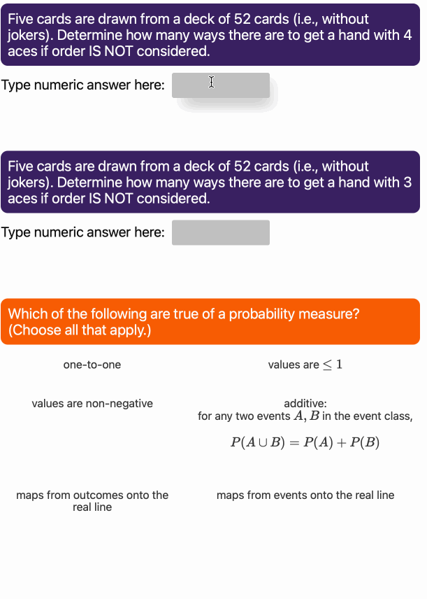

# Foundations of Data Science with Python (FDSP)

This book covers practical and mathematical foundations of data science, including:
* data visualization
* probability
* statistics
* linear algebra
* application of these fundamentals to generate meaning from data.

FDSE is targeted at learners who have basic programming experience (preferably with Python) and knowledge of one-dimensional differential and integral calculus. It is designed to replace traditional courses on Engineering Statistics and Computation Linear Algebra.

The book can be read here: https://jmshea.github.io/Foundations-of-Data-Science-with-Python

FDSP provides an interactive experience with:
* Interactive self-assessment quizzes via [JupyterQuiz](https://github.com/jmshea/jupyterquiz)

* Interactive flashcards to aid in learning terminology via [JupyterCards](https://github.com/jmshea/jupytercards)

This repository is an experiment with writing in public. I will be putting the book here while it is
still in very early and rough shape. My goals in doing this are to both offer this as a resource to the community
and to get feedback from the community. Your feedback is welcome, but please do understand that this is 
very early and rough, so please be kind!

<!--
If you find this useful... 
 
-->
Copyright 2021--2022 by John M. Shea. All rights reserved.
